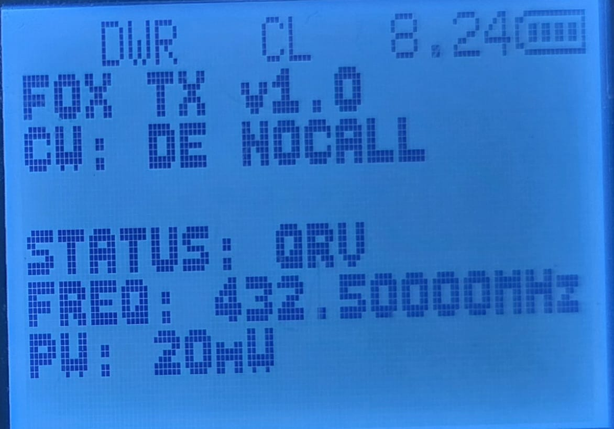

# F4HWN Firmware with CW Beacon
This is an implementation/demo of the CW beacon. A custom string and speed in WPM can be set and it will chnage each charactors into the morse code tones while transmitting it.
PS: Bandscope was replcaed to this due to the capacity issue. 
 
Contributions are also welcome~

# Use Case
I made this mainly for the FOX HUNT beacon purposes. The modulation is FM, so most of all receivers, handhelds can receive it without any problem. 

# Photos & Videos
  
Video will be uploaded soon.

# How it Works?
- App is opened using F+5 Key combination.
- Power levels can be adjusted using the up down arrow keys.
- Then press Menu Key to activate TX.
- Press Exit to stop the TX.

# Customization (New Update v1.1.0)
Customization of the CWID can now be done in the Radio menu (No. 4-8) or Via Chirp. 
You can customize variety of parameters:
- WPM
- Tone Frequency in Hz
- Initial Beep time 
- Waiting time

# Steps to Flash & Configure

## Flashing
1. Download the latest firmware file from the release page.
2. Upload it using Programming Cable.
3. Done!

## Configuration
1. Load driver module in Chirp.
2. Click Radio > Download from the radio > OK
3. Settings > CW Settings
4. Edit Parameters you want.
5. Once done, Click Radio > Upload > OK
